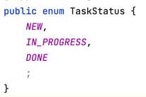

###Пожалуйста, отметься:

https://forms.gle/vjHQsQqqMfZ6W9Ro8

###План вебинара:
- Чуть-чуть про пакеты и модификаторы доступа;
- Enum;
- Создание собственных исключений;
- Про коммиты.

###Вебинар

1. Модификаторы доступа позволяют задать допустимую область видимости для членов класса, то есть контекст, в котором можно употреблять данную переменную или метод.

В Java используются следующие модификаторы доступа:
* **public**: публичный, общедоступный класс или член класса. Поля и методы, объявленные с модификатором public, видны другим классам из текущего пакета и из внешних пакетов.
* **private**: закрытый класс или член класса, противоположность модификатору public. Закрытый класс или член класса доступен только из кода в том же классе.
* **protected**: такой класс или член класса доступен из любого места в текущем классе или пакете или в производных классах, даже если они находятся в других пакетах
* **package-private** (модификатор по умолчанию). Отсутствие модификатора у поля или метода класса предполагает применение к нему модификатора по умолчанию. Такие поля или методы видны всем классам в текущем пакете.

2. Enum -- перечисляемое. Еще один тип в Java, помимо примитивов и классов (= ссылочных).
Конкретное множество значений: месяца / дни недели / статус таски.

